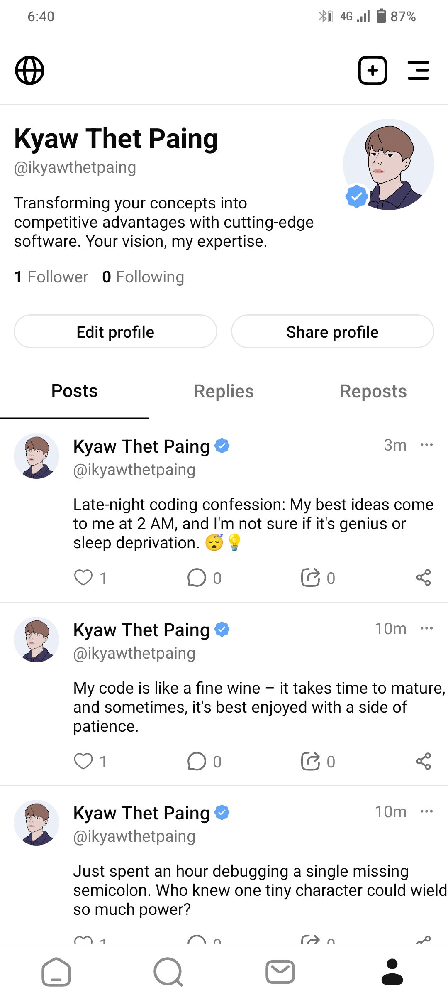

<div align="center">
    
    <h1>Nexus: The Social Media App</h1>
    <p>Nexus is a social media application that allows users to connect, share thoughts, and engage with others in real-time, similar to Twitter. This project is built using Expo, a popular framework for building cross-platform mobile apps, and Firebase, a powerful platform for developing web and mobile applications. With Nexus, users can post updates, follow others, and stay up-to-date with the latest trends and discussions.</p>
</div>

<p  align="center">
  
  
</p>
<p align="center">
  
  
  
</p>

## Features

- User Authentication: Users can create accounts, login, and password reset functionalities using Firebase Authentication.
- Profile Management: Users can edit profile details, change profile picture, and view users' posts.
- Create Posts: Users can post text-based updates, photos, and links, sharing their thoughts and experiences with followers.
- News Feed: Users can scroll through posts from friends and followers.
- Like and Comment: Users can engage with posts by liking and commenting.
- Follow and Unfollow: Users can follow and unfollow other users, enabling them to customize their feed based on their interests.
- Real-time Updates: Nexus provides real-time updates, ensuring users can instantly see new posts, likes, and comments without refreshing the app.
<!-- - Notifications: Users receive notifications for new followers, likes, comments, and mentions, enhancing their engagement with the app. -->

## Technologies Used

- Expo: Expo is an open-source platform for building native iOS, Android, and web applications using JavaScript and React. It simplifies the app development process, allowing developers to focus on writing code without worrying about the complexities of native development.
- React Native: A JavaScript framework for building native mobile applications.
- Firebase: A cloud-based platform for developing mobile and web applications.
  - Firebase Authentication: User authentication and authorization.
  - Firebase Firestore: Real-time NoSQL database for storing posts and user data.
  - Firebase Storage: Store and retrieve user images.

## Getting Started

Follow these steps to get started with the Nexus app:

1. Clone this repository:

   ```
   git clone https://github.com/ikyawthetpaing/nexus.git
   ```

2. Install dependencies:

   ```
   cd nexus
   npm install
   ```

3. Configure Firebase:

   - Create a Firebase project on the [Firebase Console](https://console.firebase.google.com/).
   - Configure Firebase Authentication and Firestore.
   - Update Firebase configuration in the app.

4. Start the Development Server:

   ```
   npm start
   ```

5. Run the App:

   - Scan the QR code with the Expo Go app on your iOS or Android device.
   - Alternatively, press a to run the app on an Android emulator or i to run it on an iOS simulator.

## Installation

[](https://github.com/ikyawthetpaing/nexus/releases/latest)

## Acknowledgments

- Vectors and icons created by [Solar Icons](https://www.svgrepo.com/author/Solar%20Icons/) listed on [SVG Repo](https://www.svgrepo.com/).

## Contributing

If you want to contribute to this project, please follow these steps:

1. Fork the repository.
2. Create a new branch for your feature or bug fix.
3. Make your changes and commit them.
4. Create a pull request with a detailed description of your changes.

## License

This project is licensed under the MIT License - see the [LICENSE](LICENSE) file for details.

## Contact

If you have any questions or suggestions, feel free to contact the project owner:

- [Kyaw Thet Paing](mailto:ikyawthetpaing@outlook.com)

Happy coding!
